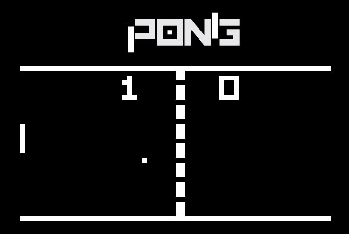

# CHIP-8 Emulator — C compiled to WebAssembly



A CHIP-8 emulator written in C, compiled to WebAssembly using [Emscripten](https://emscripten.org). Rendering is done via SDL2 on an HTML5 canvas.

## Controls (Pong)

| Action | Key |
|---|---|
| Player 1 up | `1` |
| Player 1 down | `4` |
| Player 2 up | `D` |
| Player 2 down | `C` |

## Prerequisites

- [Node.js](https://nodejs.org)
- [Emscripten (emsdk)](https://emscripten.org/docs/getting_started/downloads.html)

### Install Emscripten

```bash
git clone https://github.com/emscripten-core/emsdk.git
cd emsdk
./emsdk install latest
./emsdk activate latest
source ./emsdk_env.sh        # Linux / macOS
# or on Windows:
.\emsdk_env.bat
```

> `emcc` must be available in your PATH before running any build command. Re-run `emsdk_env` in each new terminal session, or use `--permanent` to add it to your system PATH.

## Build & Run

```bash
# Production build
npm run build

# Debug build (assertions + heap checking)
npm run build-debug

# Build then start local server (requires: npm install -g http-server)
npm start

# Start server only, no build
npm run server

# Alternative server using Python (no install needed)
python3 -m http.server 8080
```

Open `http://localhost:8080` in your browser.

> The game must be served over HTTP — opening `index.html` directly via `file://` will not work due to browser WASM restrictions.

## Project Structure

```
chip8.c / chip8.h     — Emulator core (opcodes, display, input)
html_template/        — Emscripten HTML shell template
rom/pong.c8           — Bundled ROM
index.html            — Generated output (from emcc build)
index.js / index.wasm — Generated WebAssembly bundle
```

## Implementation

- Full CHIP-8 instruction set (35 opcodes)
- 64×32 display scaled to 640×320 via SDL2 streaming texture
- Keyboard mapped to CHIP-8 hex keypad (0–F)
- Delay and sound timers decrement at 60 Hz
- 10 CPU cycles executed per frame

## Credits

- Emulator logic inspired by [arnsa/Chip-8-Emulator](https://github.com/arnsa/Chip-8-Emulator)
- General architecture inspired by [ColinEberhardt](https://github.com/ColinEberhardt)
